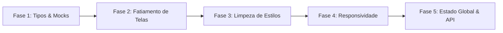

# 🚀 Plano de Otimização e Refatoração Arquitetural — Cash Me

Este documento descreve a estratégia técnica para refatorar e organizar o código do projeto **Cash Me**, transformando o protótipo monolítico inicial em uma arquitetura modular, limpa, performática e pronta para integração com APIs reais.

---

## 🔍 1. Diagnóstico do Estado Atual

| Problema Identificado | Impacto no Projeto | Solução Proposta |
| :--- | :--- | :--- |
| **Monolito em `App.tsx`** (~1.470 linhas) | Difícil manutenção, conflitos em equipe e impossibilidade de reaproveitamento. | Fatiamento em arquitetura orientada a domínios/funcionalidades (*Feature-Based Architecture*). |
| **Inline Styles Excessivos** | Código poluído, duplicação de estilos e falta de padronização. | Adoção plena do Tailwind CSS v4 e classes utilitárias. |
| **Componentes UI Ociosos** | 48 componentes do Radix/Shadcn em `src/app/components/ui/` subutilizados. | Substituição de elementos HTML genéricos pelos componentes do Design System. |
| **Mocks e Tipos no Arquivo Principal** | Dificulta testes e acopla a camada de visualização aos dados brutos. | Extração para `src/types/` e `src/data/mocks/`. |
| **Navegação por `useState` Simples** | Sem histórico do navegador, sem URLs diretas e rotas não tipadas. | Tipagem de rotas ou adoção do `react-router` já instalado. |
| **Frame Fixo de 390x844px** | Quebra a usabilidade ao abrir em smartphones reais. | Responsividade fluida (tela cheia no mobile, moldura elegante no desktop). |

---

## 🏗️ 2. Nova Arquitetura Proposta (Estrutura de Pastas)

```
src/
├── app/
│   ├── App.tsx                     # Ponto de entrada leve (Router/Seletor de Modo)
│   └── components/
│       ├── figma/                  # Utilitários de assets (ImageWithFallback)
│       └── ui/                     # Design System (Button, Card, Modal, Tabs, etc.)
│
├── features/                       # Módulos por Domínio de Negócio
│   ├── consumer/                   # Módulo do Consumidor
│   │   ├── components/             # BottomNav, StoreCard, PointsBalance, OfferCard
│   │   └── screens/                # HomeScreen, WalletScreen, StoresScreen, QRCodeScreen, ProfileScreen
│   │
│   ├── merchant/                   # Módulo do Comerciante (MVP)
│   │   ├── components/             # MetricCard, PerformanceChart, CustomerRow, CampaignCard
│   │   └── screens/                # DashboardScreen, CampaignsScreen, VitrineScreen, CustomersScreen, SettingsScreen
│   │
│   └── landing/                    # Tela inicial de boas-vindas e seleção de perfil
│       └── screens/                # LandingScreen
│
├── data/
│   └── mocks/                      # Dados simulados e centralizados
│       ├── stores.ts               # Lojas parceiras e categorias
│       ├── offers.ts               # Cupons e catálogo de recompensas
│       ├── customers.ts            # Base de clientes do lojista
│       ├── transactions.ts         # Histórico de pontuação e resgates
│       └── metrics.ts              # Dados de faturamento e gráficos
│
├── types/                          # Contratos e Tipagens TypeScript
│   ├── consumer.ts                 # Interfaces: User, Store, Offer, Transaction
│   ├── merchant.ts                 # Interfaces: Campaign, ScoringRule, Customer, Metric
│   └── navigation.ts               # Tipos literais de telas e abas de navegação
│
├── services/                       # Camada de Comunicação / API (Pronta para Backend)
│   ├── api.ts                      # Instância base do cliente HTTP
│   ├── consumerService.ts          # Chamadas de dados do consumidor
│   └── merchantService.ts          # Chamadas de dados do comerciante
│
└── styles/
    ├── fonts.css
    ├── globals.css
    ├── tailwind.css
    └── theme.css                   # Cores e tokens do Design System
```

---

## 📋 3. Fases de Execução



### 🔹 Fase 1: Extração de Tipos e Dados Mockados
- [ ] Criar `src/types/consumer.ts` e `src/types/merchant.ts`.
- [ ] Mover arrays de dados estáticos para arquivos dedicados em `src/data/mocks/`.
- [ ] Criar interfaces de navegação tipada em `src/types/navigation.ts`.

### 🔹 Fase 2: Modularização dos Componentes e Telas
- [ ] Extrair componentes compartilhados (`StatusBar`, `BottomNav`, `SegControl`, `StoreIcon`, `QRCodeSVG`) para pastas de componentes específicos.
- [ ] Mover cada tela do **Consumidor** para `src/features/consumer/screens/`.
- [ ] Mover cada tela do **Comerciante** para `src/features/merchant/screens/`.
- [ ] Reduzir `App.tsx` para menos de 100 linhas, atuando apenas como orquestrador.

### 🔹 Fase 3: Padronização Visual & Design System
- [ ] Substituir estilos inline repetitivos por classes do Tailwind CSS v4.
- [ ] Integrar os componentes de `src/app/components/ui/` (botões, diálogos, tabelas e cards).
- [ ] Centralizar tokens de cores (`G`, `GD`, `P`, `PD`, `GOLD`) no `theme.css`.

### 🔹 Fase 4: Responsividade Inteligente
- [ ] Detectar viewport: se for mobile (`< 640px`), renderizar em 100% da tela sem moldura fixa.
- [ ] Se for desktop (`>= 640px`), manter a moldura de smartphone com background gradiente para testes e demonstrações.

### 🔹 Fase 5: Gerenciamento de Estado & Camada de API
- [ ] Implementar contexto global ou Zustand para persistência local (ex: criar oferta no lojista reflete imediatamente no consumidor).
- [ ] Estruturar `src/services/` com endpoints preparados para receber a API REST/GraphQL do backend.

---

## 🎯 Benefícios Esperados

1. **Escalabilidade:** Novas telas e funcionalidades poderão ser criadas em arquivos isolados sem risco de quebrar outras partes do app.
2. **Performance & Leitura:** Código mais limpo, componentes reutilizáveis e bundle otimizado.
3. **Facilidade de Manutenção:** Manutenção simplificada para equipes e preparação imediata para o consumo de APIs de backend.
